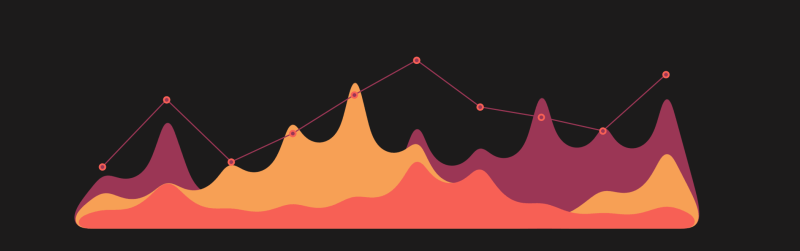

  

<h1 align="center">Hi 👋, I'm Parth Chaudhary</h1>
<h3 align="center">Embracing the world of coding and technology as a Computer Science undergraduate, driven by passion and curiosity. Open for feedback.</h3>

 

- 🌱 I’m currently learning **AI/Machine Learning**

- 👨‍💻 All of my projects are available at [Git-Hub](https://github.com/Pikolosan)

- 💻 Visit My Portfolio : [Portfolio](https://pikolosan-portfolio.vercel.app/)

- 💬 Ask me about **Full Stack WebDevlopment**

- 📫 How to reach me **parthchaudhary.jc@gmail.com** or on Instagram and LinkedIn.

- ⚡ Fun fact **I once spent an entire weekend coding a mini-game in Python and Unreal, just for the fun of it.**

 

## 🔗 Connect with me:

 

## 🛠️ Languages and Tools:

  
  
  
  
  
  
  
  
  
  
  
  

 

  
  

